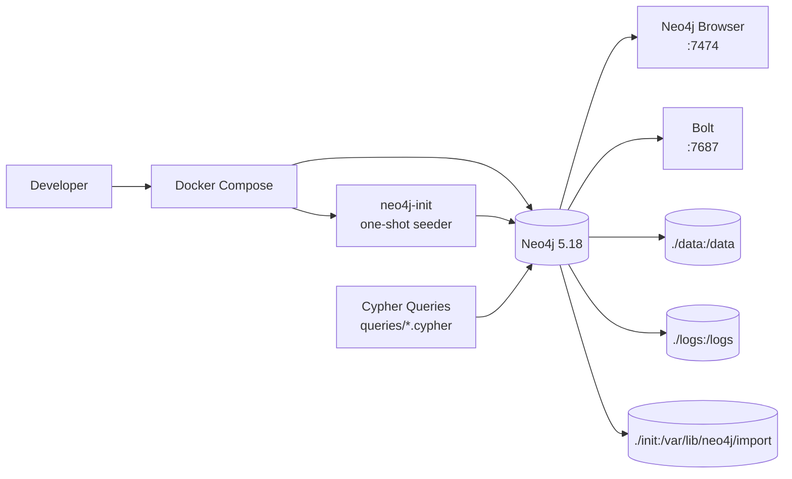

# Movie Knowledge Graph — Neo4j + Docker Compose + Cypher

Welcome to a clean, reproducible movie knowledge graph. This project models movies, people, and genres as a property graph in Neo4j 5.18, containerized with Docker Compose. Spin it up with one command and you get a healthy Neo4j instance with seed data ready to explore in Browser or via Bolt.

## Table of Contents
- [Overview](#overview)
- [Why a graph?](#why-a-graph)
- [Why Neo4j?](#why-neo4j)
- [Architecture](#architecture)
- [Data Model](#graph-data-model)
- [Project Structure](#project-structure)
- [Prerequisites](#prerequisites)
- [Setup](#setup)
- [Start the Database](#starting-the-database)
- [Access Neo4j](#accessing-neo4j-browser)
- [Run Queries](#running-cypher-queries)
- [Query Guide](#query-descriptions)
- [Verification Checklist](#verification-checklist)
- [Resetting](#resetting-the-database)
- [Troubleshooting](#troubleshooting)
- [Security Notes](#security-considerations)
- [Design Decisions](#design-decisions)
- [Future Improvements](#future-improvements)
- [Quick Start](#quick-start-copy-paste)

## Overview

A production-grade, containerized Movie Knowledge Graph built on Neo4j 5.18. It models movies, people, and genres as a property graph and ships idiomatic Cypher queries for traversal, mutation, and analytics.

The goal is deterministic and reproducible: `docker compose up -d` boots a healthy Neo4j instance with seed data, no manual steps.

## Problem Statement

Relational models struggle with relationship-centric questions:

- Which actors co-occurred in a film?
- What is the shortest collaboration path between two people?
- Who are the most connected individuals in the network?

A property graph makes traversals first-class, enabling expressive pattern matching without expensive JOINs.

## Why a Graph?

| Concern | Relational | Graph |
|---------|------------|-------|
| Relationship traversal | JOIN-heavy, O(n joins) | O(traversal) via pointers |
| Schema evolution | ALTER TABLE | Add labels / relationships dynamically |
| Recommendations | Complex | Native path finding |
| Visualization | Indirect | `CALL db.schema.visualization()` |

Graphs are the natural representation for knowledge networks where entities and connections are both data.

## Why Neo4j?

- Mature Cypher for declarative pattern matching: `MATCH (a)-[:REL]->(b)`
- ACID transactions with native graph storage
- Official Docker image `neo4j:5.18.0` pinned for reproducibility
- Browser UX at `http://localhost:7474`
- Bolt protocol `bolt://localhost:7687` for programmatic access
- Constraints & indexes via `CREATE CONSTRAINT ... IF NOT EXISTS` (Neo4j 5.x syntax)
- Ecosystem ready for APOC / GDS without requiring plugins for this project

## Architecture



Seed flow: `docker compose up -d` → Neo4j starts → healthcheck passes → `neo4j-init` waits for Bolt, runs `cypher-shell -f /init/seed.cypher` → seed is idempotent, restarts are safe.

## Graph Data Model

### Node Labels

| Label | Properties | Constraint |
|-------|------------|------------|
| `Movie` | `title`, `released`, `tagline`, `rating` (optional) | `title` UNIQUE |
| `Person` | `name`, `born` | `name` UNIQUE |
| `Genre` | `name` | `name` UNIQUE |

### Relationship Types

```
(:Person)-[:ACTED_IN {roles: [String]}]->(:Movie)
(:Person)-[:DIRECTED]->(:Movie)
(:Person)-[:PRODUCED]->(:Movie)
(:Movie)-[:HAS_GENRE]->(:Genre)
```

Direction is enforced as above.

### Examples

```cypher
// Person -> ACTED_IN -> Movie -> HAS_GENRE -> Genre
(Keanu Reeves:Person {born:1964})-[:ACTED_IN {roles:['Neo']}]->(The Matrix:Movie {released:1999})-[:HAS_GENRE]->(Sci-Fi:Genre)

// Director
(Lana Wachowski:Person)-[:DIRECTED]->(The Matrix)

// Producer
(Joel Silver:Person)-[:PRODUCED]->(The Matrix)
```

Visual model:
```
Person ──ACTED_IN──> Movie ──HAS_GENRE──> Genre
Person ──DIRECTED──> Movie
Person ──PRODUCED──> Movie
```

## Project Structure

```
movie-knowledge-graph/
├── docker-compose.yml      # Neo4j + init service, healthcheck, volumes
├── .env.example            # Template for NEO4J_AUTH
├── .gitignore              # Ignores .env, data/, logs/
├── README.md               # This file
├── init/
│   └── seed.cypher         # Idempotent seed (constraints, genres, people, movies, rels)
├── queries/
│   ├── create_movie.cypher
│   ├── find_actor_movies.cypher
│   ├── find_co_actors.cypher
│   ├── update_movie_rating.cypher
│   ├── delete_movie.cypher
│   └── analytics_degree.cypher
├── data/                   # Neo4j data volume
└── logs/                   # Neo4j logs volume
```

## Prerequisites

- Docker Desktop or Docker Engine + Compose plugin
- `docker compose` v2 (or `docker-compose` v1)
- Ports 7474 and 7687 free

Verify:
```bash
docker --version
docker compose version
```

## Setup

```bash
git clone <repo-url> movie-knowledge-graph
cd movie-knowledge-graph
cp .env.example .env
```

Edit `.env` with a secure password. Strict format: `neo4j/<password>`

```
NEO4J_AUTH=neo4j/your-secure-password
```

`.env` is gitignored. On Windows PowerShell use `Copy-Item .env.example .env`.

### Docker Setup

`docker-compose.yml` provides:
- Image: `neo4j:5.18.0` pinned
- Service name: `neo4j`
- Ports: `7474:7474`, `7687:7687`
- Volumes: `./data:/data`, `./logs:/logs`, `./init:/var/lib/neo4j/import`
- Healthcheck: `wget --spider http://localhost:7474/ || curl -f http://localhost:7474/`
- Init service: `neo4j-init` waits for healthy, extracts password from `NEO4J_AUTH`, polls Bolt, runs seed. Idempotent.

## Starting the Database

```bash
docker compose up -d
docker compose ps
docker compose logs neo4j
docker compose logs neo4j-init   # should show "Seed completed successfully"
```

Wait ~30-45s for `neo4j` to become healthy. Init runs automatically.

## Accessing Neo4j Browser

- Browser: http://localhost:7474 — login `neo4j` / password from `.env`
- Bolt: `bolt://localhost:7687`

Quick schema checks:
```cypher
SHOW CONSTRAINTS;
CALL db.labels();
CALL db.relationshipTypes();
```

## Running Cypher Queries

### Via Browser
Open http://localhost:7474, paste file contents, run.

### Via cypher-shell

Extract password first:
```bash
# Linux/macOS
export PASS=$(cut -d'/' -f2 .env | cut -d'=' -f2)

# Windows PowerShell
$PASS = (Get-Content .env | Where-Object { $_ -match "NEO4J_AUTH" }) -replace ".*\/",""
```

Run:
```bash
docker exec -it movie-graph-neo4j cypher-shell -u neo4j -p $PASS -f /var/lib/neo4j/import/seed.cypher
docker exec -i movie-graph-neo4j cypher-shell -u neo4j -p $PASS < queries/find_actor_movies.cypher
```

Host-side if `cypher-shell` is installed:
```bash
cypher-shell -a bolt://localhost:7687 -u neo4j -p <password> -f queries/find_actor_movies.cypher
```

One-liner:
```bash
docker exec movie-graph-neo4j cypher-shell -u neo4j -p $PASS "MATCH (m:Movie) RETURN m.title ORDER BY m.title;"
```

## Query Descriptions

| File | Purpose | Key Concepts | Expected Behavior |
|------|---------|--------------|-------------------|
| `create_movie.cypher` | Create `V for Vendetta` + link Hugo Weaving | `MERGE`, idempotency | Safe to run twice, no duplicates |
| `find_actor_movies.cypher` | Filmography of Keanu Reeves | Pattern matching, traversal | Returns `John Wick`, `The Matrix` |
| `find_co_actors.cypher` | Co-actors of Hugo Weaving in The Matrix | Multi-hop, `WHERE coActor <> target` | Returns Carrie-Anne Moss, Keanu Reeves, Laurence Fishburne |
| `update_movie_rating.cypher` | Set rating 8.7 on The Matrix | `MATCH`, `SET`, `RETURN` | Returns `8.7` |
| `delete_movie.cypher` | Remove placeholder | `DETACH DELETE` | Movie no longer found |
| `analytics_degree.cypher` | Top-5 most connected people | Aggregation, `OPTIONAL MATCH`, `ORDER BY` | Returns `name`, `degree`, ≤5 rows, sorted |

## Expected Outputs

```cypher
// find_actor_movies.cypher
title
"John Wick"
"The Matrix"

// find_co_actors.cypher
name
"Carrie-Anne Moss"
"Keanu Reeves"
"Laurence Fishburne"

// update_movie_rating.cypher
title          | rating
"The Matrix"   | 8.7

// analytics_degree.cypher
name | degree
"Keanu Reeves" | 3
...
```

## Verification Checklist

```bash
docker compose ps
docker compose logs neo4j | tail
cypher-shell -a bolt://localhost:7687 -u neo4j -p $PASS "SHOW CONSTRAINTS;"
cypher-shell -a bolt://localhost:7687 -u neo4j -p $PASS "MATCH (m:Movie {title:'The Matrix'}) RETURN m.released, m.tagline;"
cypher-shell -a bolt://localhost:7687 -u neo4j -p $PASS "MATCH (p:Person {name:'Keanu Reeves'}) RETURN p.born;"
cypher-shell -a bolt://localhost:7687 -u neo4j -p $PASS -f queries/create_movie.cypher
cypher-shell -a bolt://localhost:7687 -u neo4j -p $PASS -f queries/find_actor_movies.cypher
cypher-shell -a bolt://localhost:7687 -u neo4j -p $PASS -f queries/find_co_actors.cypher
cypher-shell -a bolt://localhost:7687 -u neo4j -p $PASS -f queries/update_movie_rating.cypher
cypher-shell -a bolt://localhost:7687 -u neo4j -p $PASS -f queries/analytics_degree.cypher
cypher-shell -a bolt://localhost:7687 -u neo4j -p $PASS -f queries/delete_movie.cypher
```

All checks should pass.

## Resetting the Database

Keep data:
```bash
docker compose down
```

Full reset:
```bash
docker compose down -v
# Windows PowerShell
Remove-Item data\* -Recurse -Force; Remove-Item logs\* -Recurse -Force
docker compose up -d
docker compose logs -f neo4j-init
```

## Troubleshooting

| Symptom | Cause | Fix |
|---------|-------|-----|
| neo4j unhealthy | Wrong `NEO4J_AUTH` format | Use `neo4j/<pwd>`, length ≥8 |
| Port in use 7474/7687 | Conflict | Stop conflicting service or change mapping |
| Init fails `NEO4J_AUTH not set` | `.env` missing | `cp .env.example .env` and edit |
| Seed not applied | Checked too early | Wait 60s, check logs, restart init |
| Constraint error | Wrong Neo4j syntax | Repo uses Neo4j 5.x `IF NOT EXISTS` syntax |
| Permission denied on data/ | Host volume perms | Fix Docker Desktop file sharing |
| Auth failed | Password mismatch | Extract with `cut -d'/' -f2 .env` |

Logs:
```bash
docker compose logs neo4j --tail 100
docker compose logs neo4j-init
```

## Security Considerations

- `.env` never committed
- No credentials in README, Cypher, or Docker image
- Volumes `data/` and `logs/` gitignored
- Use strong password ≥12 chars, rotate via `down -v` + new `.env`

## Design Decisions

1. Pinned image `neo4j:5.18.0` for reproducibility
2. `MERGE` everywhere for idempotent seeds and creates
3. Constraints first to prevent duplicates
4. Explicit `MATCH` before `MERGE` for relationships to avoid cartesian products
5. Healthcheck via `wget` avoids auth dependency
6. Dedicated `neo4j-init` container for automatic seeding without manual steps
7. Degree via `OPTIONAL MATCH (p)-[r]-()` + `count(r)` for correct zero handling
8. `DETACH DELETE` for safe removal
9. Minimal dependencies, no plugins required

## Future Improvements

- APOC init hook alternative
- Backup script with `neo4j-admin dump/load`
- CI validation with GitHub Actions
- Graph Data Science: PageRank, community detection
- Full-text indexes on `Movie.title` and `Person.name`
- Parameterized queries for app integration
- Read replicas for scale

## Quick Start (copy-paste)

```bash
cp .env.example .env
# edit .env -> NEO4J_AUTH=neo4j/<strong-password>
docker compose up -d
docker compose ps
docker compose logs neo4j-init
# Browser: http://localhost:7474
# Bolt: bolt://localhost:7687
docker compose down
# Reset: docker compose down -v
```

## Authot
MANIKANTA SURYASAI 

AIML DEVELOPER | ENGINEER
Happy exploring — the graph is ready when you are.

